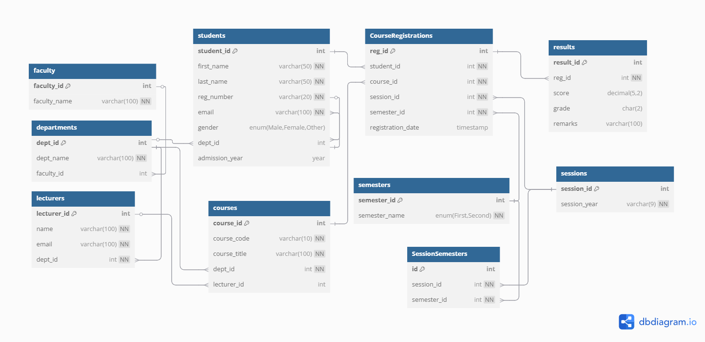

#  Physical Sciences Faculty Student Records Database

##  Project Description

This project is a relational MySQL database designed to manage student academic records for the Faculty of Physical Sciences. It handles information such as:

- Students and their departments
- Lecturers and courses
- Sessions and semesters
- Course registrations and results

The database structure is normalized, supports multiple departments and allows tracking academic progress through session and semester combinations.

---

##  How to Setup / Run

1. Open your MySQL Workbench or preferred SQL tool.
2. Import the SQL file (`PhysicalScience.sql`) into your MySQL server:
   - Use a tool like  MySQL Workbench and run all the statements to set up the database schema.
   - Or run via terminal: `mysql -u root -p < PhysicalScience.sql`

---

##  Tables Overview

- `faculty`
- `departments`
- `students`
- `lecturers`
- `sessions`
- `semesters`
- `SessionSemesters`
- `courses`
- `CourseRegistrations`
- `results`

---

##  ERD (Entity Relationship Diagram)

You can [view the ERD here](https://dbdiagram.io/d/Diagram-680b18201ca52373f54d3bb4) or upload the structure to [https://dbdiagram.io](https://dbdiagram.io) manually using their SQL import feature.

Alternatively, here is a screenshot of the ERD:

---

##  Author

Created by Golibe Martha Orji 
For My PLP database week 8 assignment.
